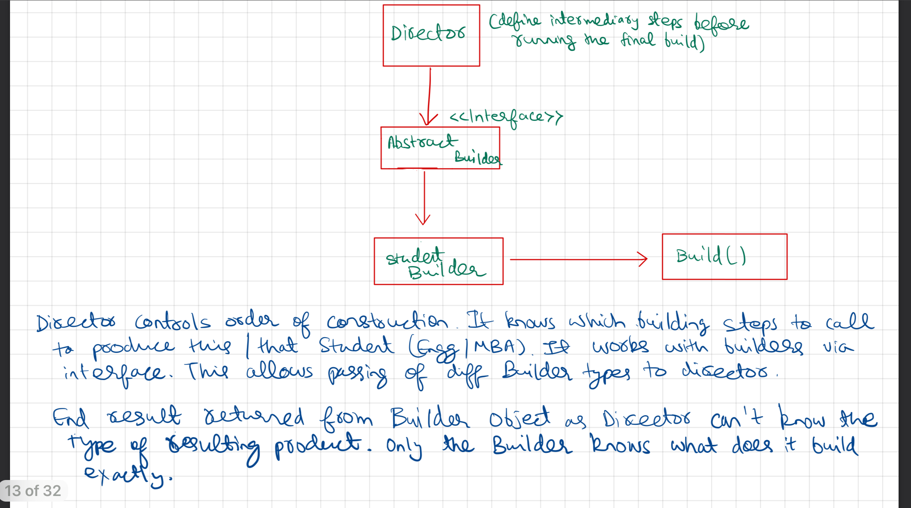

- When a class has many multiple optional fields, the problem can be
- 1) A big Constructor
- 2) Large no of constructor

- It solves the problem by step by step creation
- eg: build roof -> build window -> build door -> build( )

UML Diagram


## Code

Demo Class
```
package CreationalDesignPattern.BuilderDesignPattern;  
  
import CreationalDesignPattern.BuilderDesignPattern.Builders.Builder;  
import CreationalDesignPattern.BuilderDesignPattern.Builders.StudentBuilder;  
import CreationalDesignPattern.BuilderDesignPattern.Student.Student;  
  
public class Demo {  
    public static void main(String args[]) {  
        System.out.println(" --- Builder Design Pattern --- ");  
        Director director = new Director();  
        StudentBuilder studentBuilder = new StudentBuilder();  
        director.createEngineerStudent(studentBuilder);  
        Student Engineer = studentBuilder.build();  
        Engineer.PrintDetails();  
  
        director.createMBAStudent(studentBuilder);  
        Student mbaGrad = studentBuilder.build();  
        mbaGrad.PrintDetails();  
    }  
}
```

Student 
```
package CreationalDesignPattern.BuilderDesignPattern.Student;  
  
import CreationalDesignPattern.BuilderDesignPattern.Builders.Degree;  
import CreationalDesignPattern.BuilderDesignPattern.Builders.Stream;  
  
public class Student {  
    private Integer age;  
    private Degree courseDegree;  
    private Integer curiosity;  
    private Stream stream;  
  
    public Student(Integer age, Degree courseDegree, Integer curiosity, Stream stream) {  
        this.age = age;  
        this.courseDegree = courseDegree;  
        this.curiosity = curiosity;  
        this.stream = stream;  
    }  
  
    public void PrintDetails() {  
        System.out.println("--- Student Details ---");  
        System.out.println("Student has age of "+ age + " and completed courseDegree "+courseDegree+" , curiosityLevel is "+ curiosity+" and took stream "+ stream);  
    }  
}
```

Builders
Interface Builder
```
package CreationalDesignPattern.BuilderDesignPattern.Builders;  
  
public interface Builder {  
    void setDegree(Degree degree);  
    void setAge(Integer age);  
    void setStream(Stream stream);  
    void setCuriosity(Integer curiosityLevel);  
}
```

Student Builder
```
package CreationalDesignPattern.BuilderDesignPattern.Builders;  
  
import CreationalDesignPattern.BuilderDesignPattern.Student.Student;  
  
public class StudentBuilder implements Builder {  
    private Integer age;  
    private Degree courseDegree;  
    private Integer curiosity;  
    private Stream stream;  
  
    @Override  
    public void setAge(Integer age) {  
        this.age = age;  
    }  
  
    public void setDegree(Degree degree) {  
        this.courseDegree = degree;  
    }  
  
    public void setCuriosity(Integer curiosity) {  
        this.curiosity = curiosity;  
    }  
  
    public void setStream(Stream stream) {  
        this.stream = stream;  
    }  
  
    public Integer getAge() {  
        return age;  
    }  
  
    public Degree getCourseDegree(){  
        return courseDegree;  
    }  
  
    public Student build() {  
        return new Student(age, courseDegree, curiosity, stream);  
    }  
}
```

Enum Degree
```
package CreationalDesignPattern.BuilderDesignPattern.Builders;  
  
public enum Degree {  
    BTECH,  
    MBAFinance  
}
```

Enum Stream
``
```
package CreationalDesignPattern.BuilderDesignPattern.Builders;  
  
public enum Stream {  
    SCIENCE,  
    COMMERCE,  
    ARTS  
}
```

Output
```
 --- Builder Design Pattern --- 
--- Student Details ---
Student has age of 18 and completed courseDegree BTECH , curiosityLevel is 10 and took stream SCIENCE
--- Student Details ---
Student has age of 27 and completed courseDegree MBAFinance , curiosityLevel is 25 and took stream COMMERCE
```