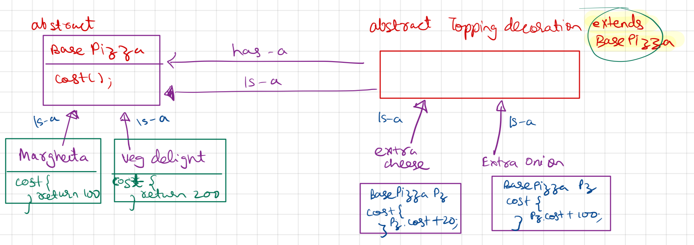

- Allows a User to add new functionality to existing Obj without altering its structure.
- Prevents class explosion (as we can have diff combination & permutation of toppings which can result into many objects)
- Has both is-a and has-a relationship
- eg: Pizza with toppings 

UML Diagram



## Code

Demo Class
```
package StructuralDesignPattern.DecoratorPattern;  
  
import StructuralDesignPattern.DecoratorPattern.Decorator.ExtraCheese;  
import StructuralDesignPattern.DecoratorPattern.Decorator.ExtraOnion;  
  
public class demo {  
    public static void main(String[] args) {  
        System.out.println("--- Decorator Design Pattern ---");  
        System.out.println(" | VegDelight = rs 200 | Extra Onion = rs 20 | Extra Cheese = rs 10");  
        BasePizza vegDelightPizza = new ExtraOnion(new ExtraCheese(new VegDelight()));  
        System.out.println("VegDelight Pizza cost with extraCheese and ExtraOnion = rs." + vegDelightPizza.cost());  
    }  
}
```

Base Pizza (Interface)
```
package StructuralDesignPattern.DecoratorPattern;  
  
public abstract class BasePizza {  
    public abstract int cost(); //abstract method would not have any body  
}
```

Margheeta - Concrete BasePizza Class
```
package StructuralDesignPattern.DecoratorPattern;  
  
public class Margheeta extends BasePizza {  
    @Override  
    public int cost() {  
        return 100;  
    }  
}
```

VegDelight - Concrete BasePizza Class
``
```
package StructuralDesignPattern.DecoratorPattern;  
  
public class VegDelight extends BasePizza {  
    public int cost() {  
        return 200;  
    }  
}
```

Decorator Interface
```
package StructuralDesignPattern.DecoratorPattern.Decorator;  
  
import StructuralDesignPattern.DecoratorPattern.BasePizza;  
  
public abstract class ToppingDecorator extends BasePizza {  
    public abstract int cost();  
}
```

Onion - Toppings Decorator
```
package StructuralDesignPattern.DecoratorPattern.Decorator;  
  
import StructuralDesignPattern.DecoratorPattern.BasePizza;  
  
public class ExtraOnion extends ToppingDecorator {  
    BasePizza basePizza;  
  
    public ExtraOnion(BasePizza basePizza) {  
        this.basePizza = basePizza;  
    }  
    @Override  
    public int cost() {  
        return basePizza.cost() + 20;  
    }  
}
```

ExtraCheese - ToppingDecorator
```
package StructuralDesignPattern.DecoratorPattern.Decorator;  
  
import StructuralDesignPattern.DecoratorPattern.BasePizza;  
  
public class ExtraCheese extends ToppingDecorator {  
    BasePizza basePizza;  
  
    public ExtraCheese(BasePizza basePizza) {  
        this.basePizza = basePizza;  
    }  
    @Override  
    public int cost() {  
        return basePizza.cost() + 10;  
    }  
}
```

Output
```
--- Decorator Design Pattern ---
 | VegDelight = rs 200 | Extra Onion = rs 20 | Extra Cheese = rs 10
VegDelight Pizza cost with extraCheese and ExtraOnion = rs.230
```