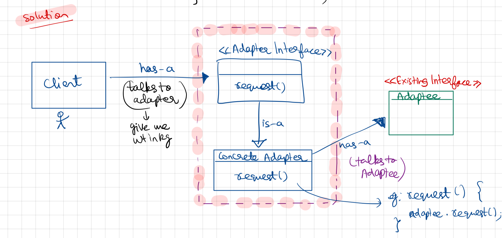

- Adapter acts as a bridge between Expected Interface and Existing Interface.
- Eg: Power Adapter, Client wants weight in kgs and Adaptee has weight in pounds
- Client talks to Adapter | Adapter has a -> Adaptee

UML Diagram


## Code

Demo Class
```
package StructuralDesignPattern.AdapterPattern;  
  
public class Demo {  
    public static void main(String[] args) {  
        System.out.println("-- Adapter Pattern -----");  
        EnemyTank rx7Tank = new EnemyTank();  
        EnemyRobot robo = new EnemyRobot();  
        EnemyRobotAdapter adapterRobot = new EnemyRobotAdapter(robo);  
  
        System.out.println("-- Enemy Tank---");  
        rx7Tank.driveForward();  
        rx7Tank.fireWeapon();  
  
        System.out.println("-- Robot Enemy ---");  
        robo.walkForward();  
        robo.smashWithHands();  
  
        System.out.println("--- Adapter ----");  
        System.out.println(" the adapter has method of the class to which client talks ie. EnemyTank but implements like Adaptee(EnemyRobot)");  
        System.out.println("-- driveForward() --- fireWeapon()");  
        adapterRobot.driveForward();  
        adapterRobot.fireWeapon();  
  
    }  
}
```

Adapter Interface(Enemy Attacker)
```
package StructuralDesignPattern.AdapterPattern;  
  
public interface EnemyAttacker {  
    public void fireWeapon();  
    public void driveForward();  
}
```

AdapterConcrete Class (EnemyRobotAdapter)
```
package StructuralDesignPattern.AdapterPattern;  
  
public class EnemyRobotAdapter implements EnemyAttacker {  
    EnemyRobot enemyRobot;  
    public EnemyRobotAdapter(EnemyRobot enemyRobot) {  
        this.enemyRobot = enemyRobot;  
    }  
  
    public void driveForward() {  
        enemyRobot.walkForward();  
    }  
  
    public void fireWeapon() {  
        enemyRobot.smashWithHands();  
    }  
}
```

Adaptee Class( EnemeyRobot)
```
package StructuralDesignPattern.AdapterPattern;  
  
public class EnemyRobot {  
    public void smashWithHands() {  
        System.out.println("Enemy Robot Smashes with Hands");  
    }  
  
    public void walkForward() {  
        System.out.println("Enemy Robot walks Forward");  
    }  
  
}
```

Enemy Tank (Concrete class of Adapter Interface)
```
package StructuralDesignPattern.AdapterPattern;  
  
public class EnemyTank implements  EnemyAttacker {  
    @Override  
    public void driveForward() {  
        System.out.println("Enemy Tank drives forward");  
    }  
  
    @Override  
    public void fireWeapon() {  
        System.out.println("Enemy Tank fires...");  
    }  
}
```

Output
```
-- Adapter Pattern -----
-- Enemy Tank---
Enemy Tank drives forward
Enemy Tank fires...
-- Robot Enemy ---
Enemy Robot walks Forward
Enemy Robot Smashes with Hands
--- Adapter ----
 the adapter has method of the class to which client talks ie. EnemyTank but implements like Adaptee(EnemyRobot)
-- driveForward() --- fireWeapon()
Enemy Robot walks Forward
Enemy Robot Smashes with Hands
```