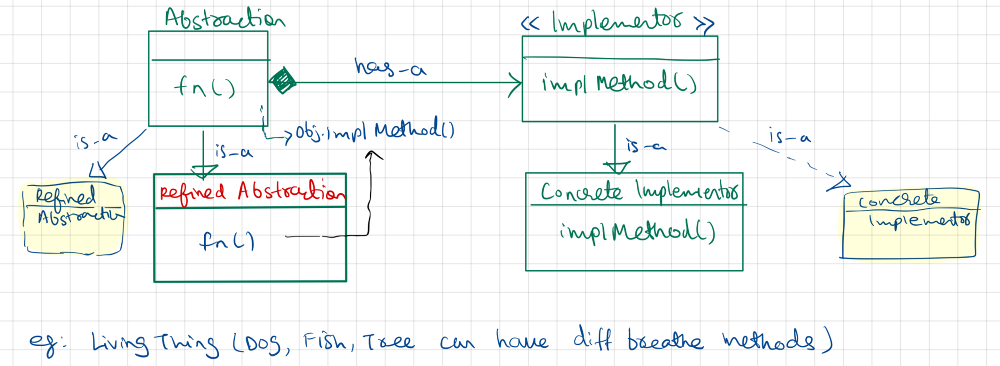

- Bridge Design Pattern decouples an abstraction from its implementation, so that two can vary independently.

```
.  Shape <>- - - - - -HAS-A - - - -> Color
	 / \                             /  \
Circle  Square                      Red Blue

```

- It attempts to solve the problem by switching from inheritance to composition(HAS-A).

| Bridge Pattern                                    | Strategy Pattern                      |
| ------------------------------------------------- | ------------------------------------- |
| To grow abstraction and impl method independently | To change behaviour of obj at runtime |


UML Diagram


## Code

Demo Class
```
package StructuralDesignPattern.BridgePattern;  
  
import StructuralDesignPattern.BridgePattern.devices.Device;  
import StructuralDesignPattern.BridgePattern.devices.Radio;  
import StructuralDesignPattern.BridgePattern.devices.TV;  
import StructuralDesignPattern.BridgePattern.remotes.AdvancedRemote;  
import StructuralDesignPattern.BridgePattern.remotes.BasicRemote;  
  
public class demo {  
    public static void main(String[] args) {  
        System.out.println("--- Bridge Design Pattern ----");  
        testDevice(new TV());  
        testDevice(new Radio());  
    }  
  
    public static void testDevice(Device device) {  
        System.out.println("-- Test Device with Basic Remote ---");  
        BasicRemote basicRemote = new BasicRemote(device);  
        basicRemote.power();  
        basicRemote.volumeUp();  
        device.printStatus();  
  
        System.out.println("-- Test Device with Advanced Remote ---");  
        AdvancedRemote advRemote = new AdvancedRemote(device);  
        advRemote.power();  
        advRemote.mute();  
        device.printStatus();  
    }  
}
```

Device
Device Interface
```
 package StructuralDesignPattern.BridgePattern.devices;  
  
public interface Device {  
    boolean isEnabled();  
    void enable();  
    void disable();  
    int getVolume();  
    void setVolume(int percent);  
    int getChannel();  
    void setChannel(int channel);  
    void printStatus();  
}
	
```

TV
```
package StructuralDesignPattern.BridgePattern.devices;  
  
public class TV implements Device {  
    private boolean on = false;  
    private int volume = 30;  
    private int channel = 1;  
  
    @Override  
    public boolean isEnabled() {  
        return on;  
    }  
  
    @Override  
    public void enable() {  
        on = true;  
    }  
  
    @Override  
    public void disable() {  
        on = false;  
    }  
  
    @Override  
    public int getVolume() {  
        return volume;  
    }  
  
    @Override  
    public void setVolume(int volume) {  
        if (volume > 100) {  
            this.volume = 100;  
        } else if (volume < 0) {  
            this.volume = 0;  
        } else {  
            this.volume = volume;  
        }  
    }  
  
    @Override  
    public int getChannel() {  
        return channel;  
    }  
  
    @Override  
    public void setChannel(int channel) {  
        this.channel = channel;  
    }  
  
    @Override  
    public void printStatus() {  
        System.out.println("------------------------------------");  
        System.out.println("| I'm TV set.");  
        System.out.println("| I'm " + (on ? "enabled" : "disabled"));  
        System.out.println("| Current volume is " + volume + "%");  
        System.out.println("| Current channel is " + channel);  
        System.out.println("------------------------------------\n");  
    }  
}
```


Radio
```
package StructuralDesignPattern.BridgePattern.devices;  
  
public class Radio implements Device{  
    private boolean on = false;  
    private int volume = 30;  
    private int channel = 1;  
  
    public boolean isEnabled() {  
        return on;  
    }  
  
    public void enable() {  
        on = true;  
    }  
  
    public void disable() {  
        on = false;  
    }  
  
    public int getVolume() {  
        return volume;  
    }  
  
    public void setVolume(int volume) {  
        if(volume > 100) {  
            this.volume = 100;  
        } else if (volume < 0) {  
            this.volume = 0;  
        } else {  
            this.volume = volume;  
        }  
    }  
  
    public int getChannel() {  
        return channel;  
    }  
  
    public void setChannel(int channel) {  
        this.channel = channel;  
    }  
  
    public void printStatus() {  
        System.out.println("------------------------------------");  
        System.out.println("| I'm radio.");  
        System.out.println("| I'm " + (on ? "enabled" : "disabled"));  
        System.out.println("| Current volume is " + volume + "%");  
        System.out.println("| Current channel is " + channel);  
        System.out.println("------------------------------------\n");  
    }  
}
```

Remote(interface)
```
package StructuralDesignPattern.BridgePattern.remotes;  
  
public interface Remote {  
    void power();  
    void volumeDown();  
    void volumeUp();  
    void channelDown();  
    void channelUp();  
}
```

BasicRemote
```
package StructuralDesignPattern.BridgePattern.remotes;  
  
import StructuralDesignPattern.BridgePattern.devices.Device;  
  
public class BasicRemote implements  Remote {  
    protected Device device;  
    public BasicRemote() {};  
    public BasicRemote(Device device) {  
        this.device = device;  
    };  
  
    public void power() {  
        System.out.println("---power toggle---");  
        if(device.isEnabled()) {  
            device.disable();  
        } else {  
            device.enable();  
        }  
    }  
  
    @Override  
    public void volumeUp() {  
        System.out.println("--device volume up");  
        device.setVolume(device.getVolume() + 10);  
    }  
  
    public void volumeDown() {  
        System.out.println("--device volume down");  
        device.setVolume(device.getVolume() - 10);  
    }  
  
    public void channelUp() {  
        System.out.println("channel UP");  
        device.setChannel(device.getChannel() + 1);  
    }  
  
    public void channelDown() {  
        System.out.println("channel DOWN");  
        device.setChannel(device.getChannel() - 1);  
    }  
}
```

Adv Remote
```
package StructuralDesignPattern.BridgePattern.remotes;  
  
import StructuralDesignPattern.BridgePattern.devices.Device;  
  
public class AdvancedRemote extends BasicRemote {  
    public AdvancedRemote(Device device) {  
        super.device = device;  
    }  
  
    public void mute() {  
        System.out.println("Adv remote: mute volume");  
        device.setVolume(0);  
    }  
}
```

Output
```
BridgePattern.demo
Connected to the target VM, address: '127.0.0.1:54689', transport: 'socket'
--- Bridge Design Pattern ----
-- Test Device with Basic Remote ---
---power toggle---
--device volume up
------------------------------------
| I'm TV set.
| I'm enabled
| Current volume is 40%
| Current channel is 1
------------------------------------

-- Test Device with Advanced Remote ---
---power toggle---
Adv remote: mute volume
------------------------------------
| I'm TV set.
| I'm disabled
| Current volume is 0%
Disconnected from the target VM, address: '127.0.0.1:54689', transport: 'socket'
| Current channel is 1
------------------------------------

-- Test Device with Basic Remote ---
---power toggle---
--device volume up
------------------------------------
| I'm radio.
| I'm enabled
| Current volume is 40%
| Current channel is 1
------------------------------------

-- Test Device with Advanced Remote ---
---power toggle---
Adv remote: mute volume
------------------------------------
| I'm radio.
| I'm disabled
| Current volume is 0%
| Current channel is 1
------------------------------------
```

