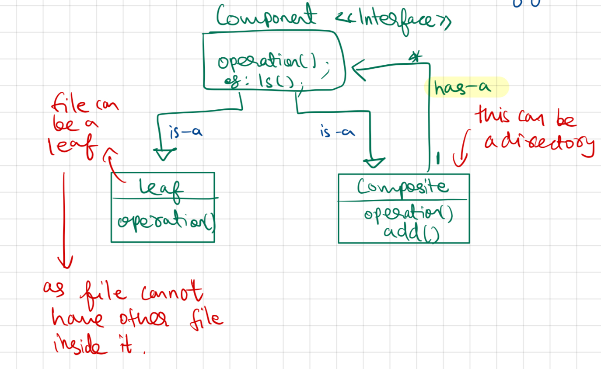

- Objects inside objects
-  Composite lets clients treat individual objects and compositions of objects uniformly.
- eg: Tree, Employee in an Organisation Structure, FileSystem(Directory, Files)

UML Diagram


## Code

Demo class
```
package StructuralDesignPattern.CompositePattern;  
  
public class demo {  
    public static void main(String[] args) {  
        System.out.println("--- Composite Design Pattern ---");  
        Directory movieDirectory = new Directory("Movies");  
        FileSystem movie1 = new File("Inception.mp4");  
        movieDirectory.add(movie1);  
        Directory comedyMovies = new Directory("Comedy-Movies");  
        FileSystem movie2 = new File("Phir Hera Pheri.mp4");  
        comedyMovies.add(movie2);  
        movieDirectory.add(comedyMovies);  
        movieDirectory.ls();  
    }  
}
```

Interface (FileSystem)
```
package StructuralDesignPattern.CompositePattern;  
  
public interface FileSystem {  
    public void ls();  
}
```

Directory
```
package StructuralDesignPattern.CompositePattern;  
  
import java.util.ArrayList;  
import java.util.List;  
  
public class Directory implements  FileSystem{  
    String directoryName;  
    List<FileSystem> fileSystemList;  
  
    public Directory(String directoryName) {  
        this.directoryName = directoryName;  
        fileSystemList = new ArrayList<>();  
    }  
  
    public void add(FileSystem fileSystemObj) {  
        fileSystemList.add(fileSystemObj);  
    }  
  
    public void ls() {  
        System.out.println("[" + directoryName + " ]");  
        for(FileSystem fileSystem: fileSystemList) {  
            System.out.print("-- ");  
            fileSystem.ls();  
        }  
    }  
}
```


FIle
```
package StructuralDesignPattern.CompositePattern;  
  
public class File implements FileSystem{  
    String filename;  
    public File(String filename) {  
        this.filename = filename;  
    }  
  
    public void ls() {  
        System.out.println(filename);  
    }  
}
```

Output
```
--- Composite Design Pattern ---
[Movies ]
-- Inception.mp4
-- [Comedy-Movies ]
-- Phir Hera Pheri.mp4
```