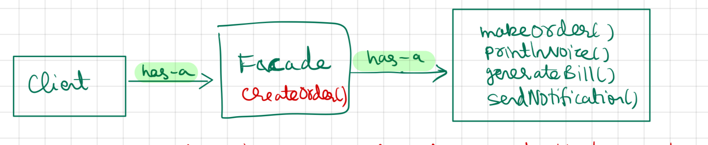

- When to use ?
	- When we want to hide the system complexity from the client.
	- eg: Driving (Brake, Accelerate, Gear change, etc .....)
- Facade is not mandatory
- We can use facade which uses other facade.

UML Diagram


## Code

Demo Class
```
package StructuralDesignPattern.FacadePattern;  
  
import StructuralDesignPattern.FacadePattern.facade.VideoConversionFacade;  
  
public class Demo {  
    public static void main(String[] args) {  
        System.out.println("--Facade Pattern---");  
        VideoConversionFacade converter = new VideoConversionFacade();  
        converter.convertVideo("youtubevideo.ogg", "mp4");  
    }  
}
```

VideoFile
```
package StructuralDesignPattern.FacadePattern;  
  
public class VideoFile {  
    private String name;  
    private String codecType;  
  
    public VideoFile(String name) {  
        this.name = name;  
        this.codecType = name.substring(name.indexOf(".")+1);  
    }  
  
    public String getCodecType() {  
        return codecType;  
    }  
  
    public String getName() {  
        return name;  
    }  
}
```
Codec Interface
```
public interface Codec {  
    public String getType();  
}
```


OggCompressionCodec
```
public class OGGCompresionCodec implements Codec {  
    public String type = "ogg";  
  
    public String getType() {  
        return type;  
    }  
}
```

Mpeg4 CompressionCodec
```
package StructuralDesignPattern.FacadePattern;  
  
public class MPEG4CompressionCodec implements  Codec {  
    public String type = "mp4";  
  
    public String getType() {  
        return type;  
    }  
}
```

CodecFactory
```
public class CodecFactory {  
    public static Codec extract(VideoFile file) {  
        String type = file.getCodecType();  
        if(type.equals("mp4")) {  
            System.out.println("codecFactory: extracting mpe4g audio...");  
            return new MPEG4CompressionCodec();  
        } else {  
            System.out.println("codecFactory: extracting ogg audio...");  
            return new OGGCompresionCodec();  
        }  
    }  
}
```

VideoConversionFacade
```
package StructuralDesignPattern.FacadePattern.facade;  
  
import StructuralDesignPattern.FacadePattern.*;  
  
public class VideoConversionFacade {  
    public void convertVideo(String filename, String format) {  
        System.out.println("VideoConversionFacade: conversion started...");  
        VideoFile file = new VideoFile(filename);  
        Codec sourceCodec = CodecFactory.extract(file);  
        System.out.println("VideoConversionFacade: conversion completed to => " + sourceCodec.getType() + " format");  
    }  
}
```

Output
```
--Facade Pattern---
VideoConversionFacade: conversion started...
codecFactory: extracting ogg audio...
VideoConversionFacade: conversion completed to => ogg format
```
